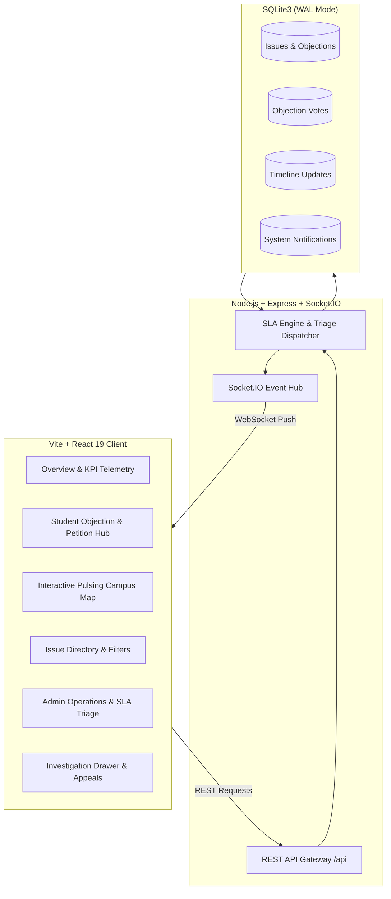

# 🏛️ Campus Pulse — Live University Operations & Student Objection Redressal Platform

[](https://nodejs.org/)
[](https://react.dev/)
[](https://vitejs.dev/)
[](https://socket.io/)
[](https://www.sqlite.org/)

A mission-critical, real-time campus intelligence and operations platform designed with a dark command-center aesthetic (`#080b10` graphite background, neon signal `#d9ff62` accents). Engineered specifically to bridge the communication gap between university students and campus operations staff, with a primary focus on **Student Objections, Academic Disputes, and Collective Petitions**.

---

## 🌟 Key Pillars & Features

### 1. 📢 Student Objection & Grievance Redressal Board (Primary Focus)
* **Formal Objections**: Students and Class Representatives can lodge structured academic, exam grading, attendance penalty, and cafeteria complaints directly to relevant university authorities.
* **Collective Campus Petitions**: Students can launch petitions (e.g., additional shuttle bus routes, lab GPU access) that automatically trigger executive administrative review once the **100-signature threshold** is achieved.
* **Real-time Peer Endorsements (Upvoting)**: Students can upvote active objections with live Socket.IO counter updates to signal priority to administrative deans.
* **Anonymous Protection Protocol**: One-click toggle allowing whistleblowers and students to file sensitive grievances safely without public identity exposure.
* **Dispute Appeals**: If a student is dissatisfied with an administrative verdict, they can lodge an executive appeal to the University Syndicate directly from the investigation drawer.

### 2. 🗺️ Geospatial Campus Telemetry & Live Map
* Interactive campus blueprint featuring university buildings (Academic Building 1 & 2, Central Library, Food Court, Gate B Bus Terminal, Residential Halls).
* **Pulsing signal markers** animated by severity (`Critical`, `High`, `Medium`, `Low`) and categorized by type.
* Hover inspection preview cards and instant drawer slide-out.

### 3. ⏱️ Operations Command, Triage & SLA Enforcement
* **Operations Triage Queue**: Unhandled tickets and objections prioritized by urgency.
* **SLA Countdown Tracking**: Enforces guaranteed turnaround times (24h for Critical, 36h for High, 48h for Medium).
* **Binding Administrative Verdicts**: Officers and faculty leads can record official findings and attach public resolution statements.
* **Audit Trail**: Step-by-step chronological timeline of every action taken by the investigation committee.

### 4. ⚡ Real-Time Socket.IO Synchronisation
* Instant push events across all connected clients without page reloads:
  - `issue:new` — New reports and objections broadcast immediately.
  - `objection:voted` — Real-time upvote updates.
  - `issue:updated` — Status transitions and published verdicts.
  - `notification:new` — System-wide urgent broadcast alerts.

---

## 🏗️ System Architecture



---

## 🚀 Quick Start

### Prerequisites
* **Node.js**: v18+ (tested on Node v24.x)
* **npm**: v9+

### Installation & Launch

1. **Clone the repository:**
   ```bash
   git clone https://github.com/Shreyalien/Campus-Pulse.git
   cd Campus-Pulse
   ```

2. **Install dependencies:**
   ```bash
   npm install
   ```

3. **Start Fullstack Development Mode:**
   ```bash
   npm run dev
   ```
   * **Client UI**: `http://localhost:3000` (proxies `/api` and `/socket.io` to backend)
   * **API & Socket.IO Server**: `http://localhost:5001`

---

## 📡 REST API Reference

| Endpoint | Method | Description |
| :--- | :--- | :--- |
| `/api/health` | `GET` | Health check & system record counts |
| `/api/issues` | `GET` | Retrieve issues/objections with multi-filters (`type`, `category`, `status`, `search`) |
| `/api/issues/:id` | `GET` | Single issue with investigation timeline and vote status |
| `/api/issues` | `POST` | Lodge a new issue, formal student objection, or campus petition |
| `/api/issues/:id/vote` | `POST` | Toggle peer upvote / petition signature |
| `/api/issues/:id/appeal` | `POST` | Lodge a formal student appeal against a verdict |
| `/api/issues/:id` | `PATCH` | Update status, assign officer, and publish official verdict |
| `/api/analytics/summary` | `GET` | KPI metrics (Active, Objections, SLA compliance, Endorsements) |
| `/api/analytics/trends` | `GET` | 7-day velocity chart data |
| `/api/analytics/categories` | `GET` | Category distribution |
| `/api/analytics/departments` | `GET` | Departmental resolution workload |
| `/api/notifications` | `GET` | System notification stream |

---

## 🎨 Design Philosophy
Adheres to a **Command-Center Dark Palette**:
* Background: `#080b10` deep graphite
* Surface / Card: `#0e131a` and `#111822` with hairline borders (`#1e293b`)
* Signal Accents: `#d9ff62` (Electric Lime), `#f59e0b` (Amber Alert), `#ef4444` (Critical Red)
* Micro-interactions powered by **Framer Motion**
* Data visualizations via **Recharts**

---

## 👥 Contributors & Maintainers
Developed for **Daffodil International University (DIU)** Campus Operations.
* **Lead Developer**: Shreya Golder (`251-15-467@diu.edu.bd`)
