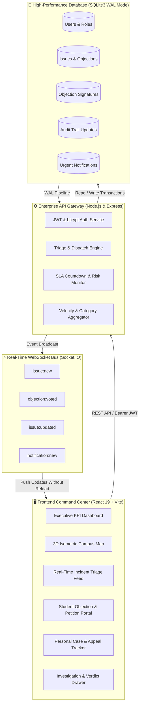
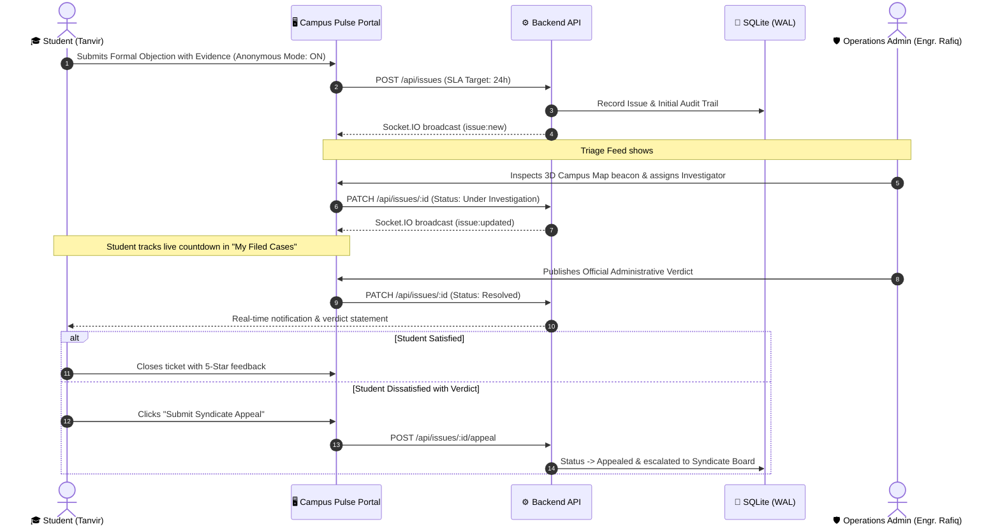

# 🏛️ Campus Pulse — Live University Operations & Student Objection Redressal Platform

[](https://nodejs.org/)
[](https://react.dev/)
[](https://vitejs.dev/)
[](https://socket.io/)
[](https://www.sqlite.org/)
[](https://jwt.io/)

> **A mission-critical, real-time campus intelligence and student grievance redressal command center.** Engineered to transform administrative communication, eliminate bureaucratic delays, and guarantee transparent resolution timelines across university operations.

---

## 📖 The Problem & The Mission

In conventional university environments, student grievances—such as **server downtime during exam deadlines, unfair attendance fines, cafeteria hygiene and price hikes, transport shuttle overcrowding, and damaged lab equipment**—are handled via lost paper applications and opaque administrative delays. Students frequently fear academic retribution when raising individual disputes, while operations teams lack unified geospatial telemetry to dispatch maintenance technicians effectively.

**Campus Pulse** solves this with a **high-availability command-center interface**:
1. **Student Whistleblower Protection**: An anonymous encryption mode shields students from academic bias while preserving full investigation traceability.
2. **SLA-Guaranteed Redressal**: University authorities commit to a legally traceable **Service Level Agreement (24h to 48h)** resolution countdown.
3. **Collective Student Voice (Petitions)**: Once a petition gathers 100 peer signatures, it is automatically escalated to the **University Syndicate & Dean Review Board**.
4. **Constitutional Right to Appeal**: Students can challenge any adverse administrative verdict with an instant formal appeal.

---

## 🌟 Core Feature Matrix

```
┌─────────────────────────────────────────────────────────────────────────────────────────────┐
│                                   CAMPUS PULSE PLATFORM                                     │
├───────────────────────────────┬───────────────────────────────┬─────────────────────────────┤
│  🎓 Student Objection Hub     │  🗺️ 3D Campus Geospatial Map  │  ⚡ Ops Command & SLA Queue │
├───────────────────────────────┼───────────────────────────────┼─────────────────────────────┤
│ • Formal Course & Exam Claims │ • Isometric 3D Campus Grid    │ • Urgent / Minor Triage     │
│ • Anonymous Whistleblower     │ • DIU Smart Campus & Universal│ • Binding Verdict Publisher │
│ • 100-Signature Auto-Escalate │ • Glowing Live Beacon Pins    │ • 24h/36h/48h SLA Timers    │
│ • Photographic Evidence URLs  │ • Hover Previews & Drawers    │ • Syndicate Appeal Pipeline │
│ • Real-time Peer Upvoting     │ • Live Telemetry Markers      │ • Audit Trail Timeline Logs │
└───────────────────────────────┴───────────────────────────────┴─────────────────────────────┘
```

---

## 🏗️ System Architecture & Telemetry Pipeline



---

## 🔄 Student Objection & Resolution Lifecycle



---

## 🗺️ Campus Mapping Engine: DIU Ashulia & Universal Adaptability

Campus Pulse features a dual-mode **3D Isometric Vector Blueprint**:
1. **DIU Ashulia Smart Campus Mode**: Tailored for Daffodil International University permanent campus landmarks:
   * **Knowledge Tower / Central Library**: Research repositories, study floors, and digital archive.
   * **Academic & Admin Complex**: Faculty of Science & IT, computer laboratories, and exam halls.
   * **Student Union & Food Court**: Smart auditorium, multi-vendor cafeteria, and club suites.
   * **Yunus Khan Scholar Garden (Dorms)**: Student residential village and living quarters.
   * **Transport Terminal (Gate B)**: Campus shuttle bus fleet bays.
2. **Universal Campus Mode**: One-click toggle adapts all labels for any university campus globally.

---

## 🔐 Security & Anti-Tamper Design
* **Password Security**: Salted password hashing with `bcryptjs`.
* **Stateless Authorization**: Signed JSON Web Tokens (`jsonwebtoken`) with `Bearer` header enforcement.
* **Whistleblower Anonymity**: Anonymized IDs (`ANON-xxx`) hide student identities from peer view while maintaining internal ombudsperson tracking.
* **Anti-Scraping / Content Protection**: Global user-select prevention and context-menu protections enabled across all dashboards.

---

## 🚀 Quick Start & Installation

### Prerequisites
* **Node.js**: v18+ (tested on Node.js v24.x)
* **npm**: v9+

### 1. Clone & Install
```bash
git clone https://github.com/Shreyalien/Campus-Pulse.git
cd Campus-Pulse
npm install
```

### 2. Launch Development Environment
```bash
npm run dev
```
* **Frontend Web Dashboard**: `http://localhost:3000`
* **Enterprise API Server**: `http://localhost:5001` (automatically proxied by Vite on `:3000/api`)

### 3. One-Click Demo Accounts
For rapid presentation and evaluation, use the pre-seeded demo accounts:
| Role | Name | Email | Password | Responsibilities |
| :--- | :--- | :--- | :--- | :--- |
| **Student CR** | Tanvir Ahmed | `student@campus.edu` | `password123` | Lodge formal disputes, sign petitions, track SLA countdowns & appeal verdicts. |
| **Chief Operations Lead** | Engr. M. Rafiq | `admin@campus.edu` | `admin123` | Triage incident feed, assign officers, enforce SLA timers & publish verdicts. |
| **Faculty Exam Committee** | Dr. M. Rahman | `faculty@campus.edu` | `faculty123` | Audit course evaluations, lab server crash investigations & conduct hearings. |

---

## 📡 Enterprise REST API Specification

| Endpoint | Method | Auth | Description |
| :--- | :--- | :--- | :--- |
| `/api/auth/login` | `POST` | Public | Authenticate user & return signed JWT token |
| `/api/auth/register` | `POST` | Public | Register student with student ID & department |
| `/api/auth/me` | `GET` | Bearer | Retrieve authenticated session details |
| `/api/auth/demo-users` | `GET` | Public | Quick 1-click presentation demo accounts |
| `/api/issues` | `GET` | Public | Query issues & objections with multi-filter |
| `/api/issues` | `POST` | Optional | Lodge a formal objection, petition, or report |
| `/api/issues/:id` | `GET` | Public | Single ticket with full investigation timeline |
| `/api/issues/:id/vote` | `POST` | Optional | Toggle peer endorsement / petition signature |
| `/api/issues/:id/appeal`| `POST` | Optional | Lodge formal appeal to University Syndicate |
| `/api/issues/:id` | `PATCH` | Bearer | Update status, assign officer & publish verdict |
| `/api/analytics/summary` | `GET` | Public | KPI telemetry (Active, SLA compliance, Rating) |
| `/api/analytics/trends` | `GET` | Public | Dual-curve report volume telemetry |

---

## 👥 Contributors & Maintainers
Developed for University Campus Operations & Student Objection Redressal.
* **Developed by**: Shreya Golder
